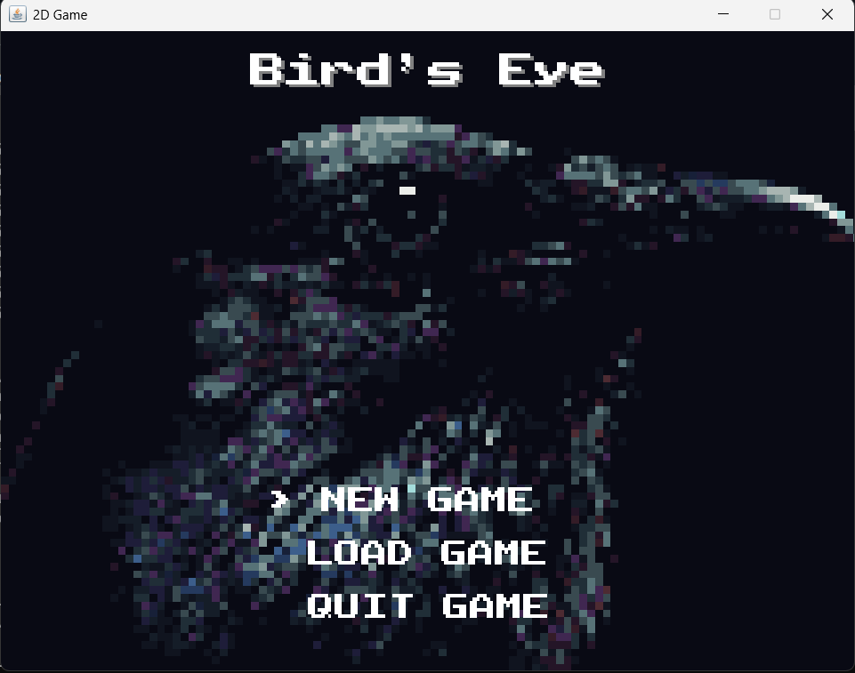
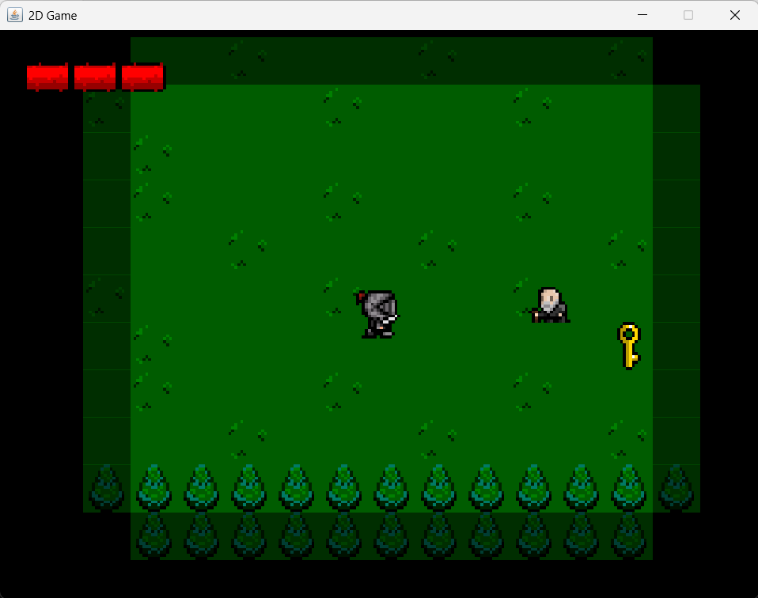

# 🕹️ Bird's Eye — 2D Java Adventure Game _(Work in Progress)_

Bird’s Eye is a compact 2D top-down action–adventure game built entirely in pure Java, using only the Java 2D API and Swing.
It’s a fully custom engine demonstrating classic game-dev systems: a fixed-timestep loop, sprite animation, tile maps, collisions, audio, and entity-based logic — all implemented from scratch.

This is an ongoing work-in-progress game, built to showcase strong fundamentals in OOP design, real-time graphics, and game engine architecture.

---

## 🧩 Overview

| | |
|--|--|
| 🎮 **Genre** | 2D Adventure / Action |
| 🧠 **Focus** | Game architecture, entity system design, and rendering |
| 🛠️ **Language** | Java 17 |
| 🧱 **Frameworks** | None — uses only Java2D and Swing |
| 🧰 **Build Tool** | Gradle (with included wrapper) |

---

## 🌟 Highlights

- **Tile-based world** with animated sprites and layered rendering order  
- **Player controller** supporting movement, sprinting, and interaction  
- **Entity system** for objects, NPCs, and monsters with collision hooks  
- **HUD & UI** for title screen, health, and dialogues  
- **Audio engine** for background music and SFX (experimental)  
- **Clean architecture** — decoupled input, rendering, and update systems  

---

## 🎬 Screenshots & Media

### Title Screen


### Gameplay


### NPC Interaction


### Enemy Example


---

## 🧭 Project Structure

| File / Directory | Description |
|------------------|-------------|
| `src/main/Main.java` | Entry point. Creates the game window and starts the loop. |
| `src/main/GamePanel.java` | Core loop — updates and renders entities at a fixed timestep. |
| `src/main/KeyHandler.java` | Input mapping and game state controls. |
| `src/main/UI.java` | Draws the HUD, dialogues, and menu screens. |
| `src/main/CollisionChecker.java` | Handles collisions between tiles, entities, and objects. |
| `src/main/AssetSetter.java` | Spawns all world assets: NPCs, monsters, and interactables. |
| `src/entity/Player.java` | Handles player movement, animation, and interactions. |
| `res/` | Assets — tiles, sprites, audio, and maps. |

---

## 🎮 Controls

| Action | Key |
|--------|-----|
| Move | **W / A / S / D** |
| Sprint | **Hold SHIFT** |
| Interact / Confirm | **ENTER** |
| Pause / Unpause | **P** |
| Menu navigation | **W / S / ENTER** |
| Toggle debug overlay | **T** |

---

## ⚙️ Build & Run

### Requirements
- **Java 11+ (JDK 17 recommended)**
- Gradle **not required locally** — use the included wrapper
- On **Windows**, ensure your JAVA_HOME is set to JDK 17 for Gradle compatibility

## How to build & run

Prerequisites

- Java Development Kit (JDK) 11 or newer installed and available on PATH. On Windows, you can install OpenJDK or Oracle JDK. On WSL/Ubuntu use `sudo apt install openjdk-17-jdk`.
- **IMPORTANT NOTE FOR WINDOWS USERS:** This version of Gradle will not run on newer `jdk` versions. For safety, use a version of `jdk-17`. You can change your system's version of Java by updating the JAVA_HOME path in Advanced System Settings -> Advanced -> Environment Variables -> System Variables.
- Gradle is not required locally. The Gradle wrapper (gradlew and gradlew.bat) is included in this repository and should be used for all builds, both locally and in CI.

Build & run (Gradle)

1. From the repository root, build the project using the Gradle wrapper (recommended):

```powershell
# Windows PowerShell (uses Gradle wrapper)
./gradlew build
```

Or on WSL/Bash:

```bash
./gradlew build
```

2. Run the produced JAR (from repo root):

```powershell
# Windows PowerShell
java -jar build\libs\BirdsEye-0.1.0.jar
```

Or on WSL/Bash:

```bash
java -jar build/libs/BirdsEye-0.1.0.jar
```

CI / GitHub Actions

This repository includes a GitHub Actions workflow that runs on push and pull requests to `main`/`master`. The workflow builds with Gradle and uploads the produced JAR as an artifact named `BirdsEye-jar`.

Tips

- If resource files (images, maps, fonts) fail to load when running from the JAR, confirm your code reads them via classpath (e.g., `getResourceAsStream`) and that the `res/` folder is included inside the JAR under `res/` (the Gradle jar task copies `res/` into the JAR).
- If you prefer an IDE workflow, import the project as a Gradle project in IntelliJ IDEA or Eclipse and run `main.Main` or the produced JAR.

## 💻 Running from an IDE (IntelliJ / Eclipse)

- Open the project folder.
- Mark `src` as the sources root (if the IDE doesn't detect it automatically).
- Configure project SDK to a matching JDK (8+).
- Run `main.Main` as a Java application.

## 🧠 Design Notes

- Fixed timestep game loop using delta time for smooth rendering at 60 FPS.
- Y-sorting of entities for correct draw order based on world Y coordinate.
- Collision detection uses entity "solidArea" rectangles and predictive checks for next-frame collisions.
- Resource pipeline uses simple relative paths and ImageIO for sprites and fonts.

## 🚧 Development Roadmap

Bird’s Eye is actively being developed.
Current goal: a fully playable vertical slice with combat, multiple areas, and NPC dialogue by Q3 2026.

### Planned Features

- Save/load system and multiple maps
- Configurable keybinds and display settings
- Sprite sheet loader and animation editor
- A* pathfinding for enemy AI
- Unit tests for map and collision logic

## 🎯 Why This Project Matters

Bird’s Eye isn’t just a small hobby game — it’s a technical showcase of how to build a full-featured, performant 2D engine using nothing but Java’s standard libraries.

It demonstrates:
- Real-time loop control
- Collision physics
- Graphics and resource management
- Modular OOP design patterns

